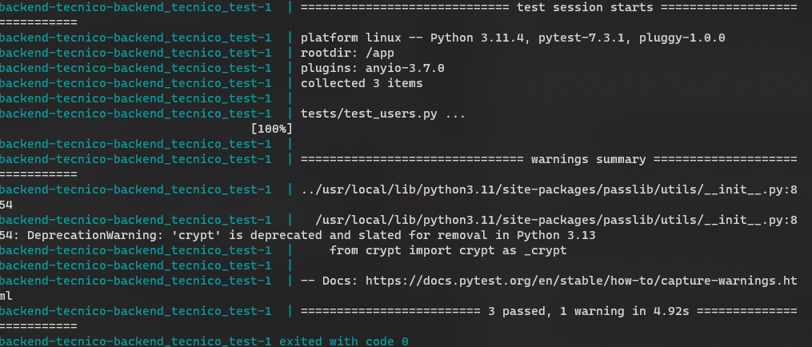

# Technical backend test

This project is a technical backend test that concist of simple operations

## Table of Contents

- [Introduction](#introduction)
- [Features](#features)
- [Technologies Used](#technologies-used)
- [Installation](#installation)
- [Usage](#usage)
- [Testing](#testing)
- [Contact](#contact)

## Introduction

This project is an API that consist of performing simple operations like signup users using a POST method and listing and retrieving user details with the email using GET method.

## Features

You can create a new user making a `POST` request to the `/users/` endopoint.

To list all the stored users yo can make a `GET` request to `users` endopint.

## Technologies Used

- [FastAPI](https://fastapi.tiangolo.com/) - Fast web framework for building APIs with Python.
- [PyMongo](https://pymongo.readthedocs.io/) - Python library for interacting with MongoDB.
- [pytest](https://docs.pytest.org/) - Testing framework for Python.
- [Docker](https://www.docker.com/products/docker-desktop/) - Service of virtualization and utilities to create containers.

## Installation

1. Clone this repository

```bash
git clone https://github.com/axelldev/backend-tecnico.git
```

## Usage

1. First create a virtual virtual environment to install the dependencies

```bash
cd backend-tecnico

python -m venv venv 

source venv/bin/activate # for linux, macos

source venv/Scripts/activate # Windows git bash

./venv/Scripts/activate # Windows

pip install -r requirements.txt
```

2. To initialize the app use docker _make shure you have open docker desktop

```bash
docker compose up
```

3. Access to the ip of the api

```
http://127.0.0.1:8000/
```

## Testing

1. To run the tests you have to run this command
```
docker compose -f docker-compose.test.yml up
```
And you will se the output of the tests



## Contact

- [GitHub](https://github.com/axelldev/backend-tecnico)
- [LinkedIn](https://www.linkedin.com/in/axell2552/)
- [Portfolio](https://axell-software-developer.netlify.app/)

---
Thank you for giving me the opportunity to be in this process ❤️.
Happy Code! 💻